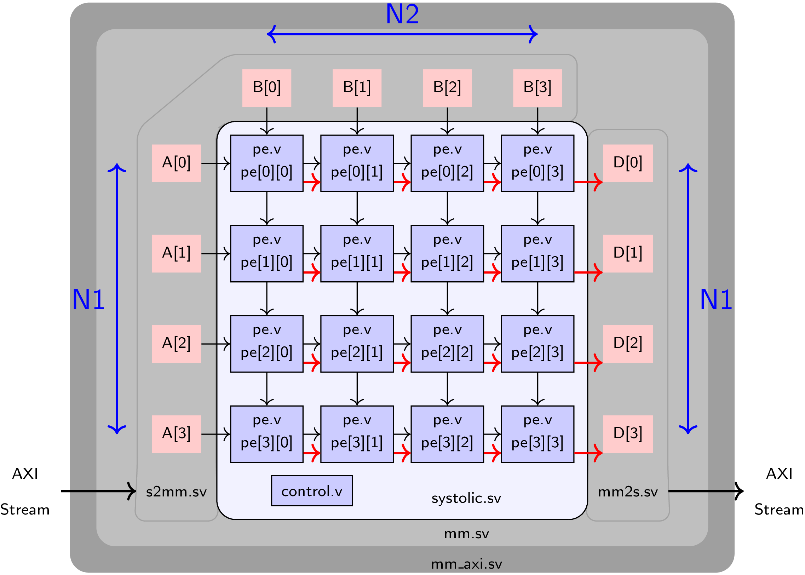

# LAB4 : Matrix Multiplication module [Deployment on the _PYNQ_ board] 

Deadline (4a): 8th July 2021 EST 23:59
Deadline (4b): 29th July 2021 EST 23:59
Deadline (4c): 6th August 2021 EST 23:59

## Getting started
First, clone the git repository in your Docker container or onto your home
directory on `eceubuntu` lab server. Note that this is an individual assignment
with a team size of 1 i.e.  yourself.


```
$ mkdir -p $HOME/ece327-s21/labs
$ cd $HOME/ece327-s21/labs
$ git clone ist-git@git.uwaterloo.ca:ece327-s21/labs/k5xing-lab4.git
$ cd k5xing-lab4
```

## Objective

In the previous lab, you designed and simulated a systolic matrix multiplication kernel. For simplicity, we read out the final result in parallel with appropriate valids.
In this lab, you will (1) modify the readout mechanism to support a systolic (serial) operation, and (2) deploy the circuit on a real FPGA board.
We will provide the required hardware infrastructure to generate input matrices on the ARM CPU of the FPGA board, send it to your systolic core, and read the result back to the ARM CPU for validation.
We will use the _PYNQ_ FPGA board for this lab, which is a hybrid FPGA+ARM SoC (System-on-Chip) that allows you to run an embedded Linux stack on the ARM CPU and use the FPGA as an accelerator. 
Pynq board also ships with user-friendly Python APIs which we will use for programming and interacting with the FPGA.
Should FPGA board deployments present a technical challenge during this
pandemic-affected term, we will use the post-place-and-route timing simulations
for grading instead.

Specific tasks are below:

* Modify your systolic array to readout the `D` result matrix serially per row. This will require a change to the interface of `pe.v`, some extra internal registers for holding state, and more wires in `systolic.sv` to shift out the data. Test your design for functional correctness by using similar test setup as the previous lab. 

* Synthesize, implement, and download your design bitstream to the _PYNQ_ board. Setup the Pynq board for use with your lab, and run the Python-based test framework to confirm correct operation.

* Alternatively, run a timing simulation after placement and routing to ensure
correct timing behavior that closely resembles on-chip behavior. This is going
to be used a a fallback should FPGA deployments present a technical challenge
during this pandemic-affected term.

## Design Description:

The components for the complete systolic design are shown below. As you can see, the design is mostly similar to that in Lab3. The important change is the new set of RAM blocks for collecting the output results `D`.


### Shifting out results:

The red link shown in the figure above will shift out the results to the RAM blocks `D` to the right of the figure. 
There are two design requirement for implementation of the readout circuit:
1. The results to the right at `PE[*,N1-1]` are pushed out to `D` first. In the figure above, `PE[*][3]` will shift out first.
2. PE cannot be paused and must continue to process the next matrix multiplication while results of the previous multiplication are shifting out.
3. You use a *constant* amount of pipelining in each PE such that the same solutions works for any `N1`. Constant is defined here as a small number of registers, one or two.

To do this, you will need to modify `pe.v` to include new input and output ports. These will be inputs `in_data` (D_W_ACC bits) + `in_valid` (1 bit) from the left, and an output `out_data` (D_W_ACC bits) + `out_valid` (1 bit) shifting data out. 

The table below illustrates the expected behaviour for the shifting out of results:

- The column headers are the different inputs and outputs of a single `pe` module, which is reset at time t=0. The positive edges of the clock happen between subsequent time values.
- Over the following cycles, the `pe` calculates two matrix values: `1 * 2 + 3 * 4 + ... + 13 * 14 + 15 * 16 = 744` and `17 * 18 + 19 * 20 + ... + 29 * 30 + 31 * 32 = 4968`. As in lab 3, the `init` signal is used to drop the value currently accumulated in the `pe`, so that a new accumulation may be started for the next value.
- The pe also receives results from other `pe`s (`100`, `101` ...) indicated by `in_valid = 1`.
- Both the values calculated by the `pe` and the values received from its neighbors to the left in the same row must be outputted through `out_data`. Note the order in which the values appear in `out_data`. The `out_data = Dc` means that we `D`on't `c`are about the value at that cycle.

We provide a testbench `pe_tb.sv` which evaluates your `pe.v` under this sequence of inputs (see the *Simulation* section below).

```
| time |   rst   |   init   |   in_a   |   in_b   |   out_a   |   out_b   |   in_data   |   in_valid   |   out_data   |   out_valid   | 
|------|---------|----------|----------|----------|-----------|-----------|-------------|--------------|--------------|---------------|
|  0   |    1    |    X     |    X     |    X     |     X     |     X     |       X     |       X      |        X     |        X      |
|  1   |    1    |    0     |    0     |    0     |     0     |     0     |      42     |       0      |        0     |        0      |
|  2   |    0    |    0     |    1     |    2     |     0     |     0     |      42     |       0      |        0     |        0      |
|  3   |    0    |    0     |    3     |    4     |     1     |     2     |      42     |       0      |        0     |        0      |
|  4   |    0    |    0     |    5     |    6     |     3     |     4     |      42     |       0      |       Dc     |        0      |
|  5   |    0    |    0     |    7     |    8     |     5     |     6     |      42     |       0      |       Dc     |        0      |
|  6   |    0    |    0     |    9     |   10     |     7     |     8     |      42     |       0      |       Dc     |        0      |
|  7   |    0    |    0     |   11     |   12     |     9     |    10     |      42     |       0      |       Dc     |        0      |
|  8   |    0    |    0     |   13     |   14     |    11     |    12     |      42     |       0      |       Dc     |        0      |
|  9   |    0    |    0     |   15     |   16     |    13     |    14     |      42     |       0      |       Dc     |        0      |
| 10   |    0    |    1     |   17     |   18     |    15     |    16     |     100     |       1      |       Dc     |        0      |
| 11   |    0    |    0     |   19     |   20     |    17     |    18     |     101     |       1      |      744     |        1      |
| 12   |    0    |    0     |   21     |   22     |    19     |    20     |     102     |       1      |      100     |        1      |
| 13   |    0    |    0     |   23     |   24     |    21     |    22     |      42     |       0      |      101     |        1      |
| 14   |    0    |    0     |   25     |   26     |    23     |    24     |      42     |       0      |      102     |        1      |
| 15   |    0    |    0     |   27     |   28     |    25     |    26     |      42     |       0      |       Dc     |        0      |
| 16   |    0    |    0     |   29     |   30     |    27     |    28     |      42     |       0      |       Dc     |        0      |
| 17   |    0    |    0     |   31     |   32     |    29     |    30     |      42     |       0      |       Dc     |        0      |
| 18   |    0    |    1     |   31     |   32     |    31     |    32     |     103     |       1      |       Dc     |        0      |
| 19   |    0    |    0     |   31     |   32     |    31     |    32     |     104     |       1      |     4968     |        1      |
| 20   |    0    |    0     |   31     |   32     |    31     |    32     |     105     |       1      |      103     |        1      |
| 21   |    0    |    0     |   31     |   32     |    31     |    32     |      42     |       0      |      104     |        1      |
| 22   |    0    |    0     |   31     |   32     |    31     |    32     |      42     |       0      |      105     |        1      |
| 23   |    0    |    0     |   31     |   32     |    31     |    32     |      42     |       0      |       Dc     |        0      |
| 24   |    0    |    0     |   31     |   32     |    31     |    32     |      42     |       0      |       Dc     |        0      |
| 25   |    0    |    0     |   31     |   32     |    31     |    32     |      42     |       0      |       Dc     |        0      |
| 26   |    0    |    0     |   31     |   32     |    31     |    32     |      42     |       0      |       Dc     |        0      |
| 27   |    0    |    0     |   31     |   32     |    31     |    32     |      42     |       0      |       Dc     |        0      |
| 28   |    0    |    0     |   31     |   32     |    31     |    32     |      42     |       0      |       Dc     |        0      |
| 29   |    0    |    0     |   31     |   32     |    31     |    32     |      42     |       0      |       Dc     |        0      |
| 30   |    0    |    0     |   31     |   32     |    31     |    32     |      42     |       0      |       Dc     |        0      |

```

You must also adapt `systolic.sv` when you instantiate the PEs and connect them to each other with these new ports.

The controller `control.v` and counter `counter.v` are unmodified from the previous lab. 

### Testbench Design :

There are three test environments for this lab.

1. The first testbench `dut_tb.sv` + `test.py` is for software functional simulation. It is mostly similar to Lab3 and will help you verify operation of your matrix multiplication in simulation. Unlike the testbench in Lab3, our current testbench models the RAM storage for `A`, `B`, and `D` matrices as if they were physical RAM blocks. There is no difference in how data is presented to your design.

2. The second testbench `mm_tb.sv` + `test.py` is for software timing simulation.

3. The third testbench `lab4-board.py` is for hardware evaluation. When you download your bitstreams into the FPGA, we have provided Python host code to help your send data from the ARM CPU to the FPGA on the Pynq board.

The test results of both scripts look the same. Watch for the `Thank Mr. Goose` or `HISSSSS` messages as relevant to the correctness of your design.

## Creating your design : 

### Design [Lab4a]

You have to create one document -- lab4.dot. Make sure `graphviz` is installed in your container as explained in Lab3. You will also need to run `apt-get install ghostscript texlive-extra-utils` via the root shell i.e. `docker exec -u root`.

[`lab4.dot`] Draw a high-level picture `lab4.pdf` of your shifting out circuit for one row of the array. We need to see connections between multiplexers and registers which have been left unconnected. Eventually, the dataflow should lead to the D0 output port.
A _graphviz_ template is provided. Edit this file using `vi` or `emacs` and run the following to generate a PDF diagram for submission. You need to draw edges using the `nodesrc->nodedst` syntax for `graphviz`. You will also need to instantiate `dff` symbols and check the lab4.dot file for examples of how to do so. Use the `pos` attribute to position the register precisely. There is enough space so you shouldn't have to move any existing objects.
```
$ make lab4a # this is all you have to do
# or if you are a curious gosling look at the insanity behind the layout and run the command below: neato layout is first run to get co-ordinates of boxes, the gvpr script will draw border around PE which is provided with dot layout but missing with neato, neato is needed as it allows precise positioniong, then I use shapes.ps to supply postscript handwritten images for input and output ports + register/FF symbol. This is all tied up nicely in the end to produce a PDF. For tech support contact nachiket@uwaterloo.ca
$ neato -n -l shapes.ps lab4.dot | gvpr -c -fnbb.g | neato -n -Tps -l shapes.ps > lab4.ps && pstopdf lab4.ps && pdfcrop lab4.pdf && mv lab4-crop.pdf lab4.pdf # no need to run this, only for academic curiosity
```

### Complete Implementation [Lab 4b]

You must provide RTL implementations of the following designs with associated interfaces.

#### `pe.v`

1. `clk` : 1 bit input : This is the clock input to the module
2. `rst` : 1 bit input : This is a synchronous reset signal
3. `init` : 1 bit input : This is the init signal that flushes the accumulator
4. `in_a` : D_W bits input : This is the first PE operand.
5. `in_b` : D_W bits input : This is the second PE operand.
6. `out_a` : D_W bits output : This is the output that streams out registered in_a
7. `out_b` : D_W bits output : This is the output that streams out registered in_b
8. `in_data` : D_W_ACC bits input : This is the input stream of `D` matrix data [**new**]
9. `in_valid` : 1 bit input : Valid signal for `in_data` [**new**]
10. `out_data` : D_W_ACC output : This is the output stream of `D` matrix data [**new**]
11. `out_valid` : 1 bit output : Valid signal for `out_data` [**new**]


#### `systolic.sv` 

1. `clk` : 1 bit input : This is the clock input to the module
2. `rst` : 1 bit input : This is a synchronous reset signal
3. `enable_row_count_A` : 1 bit input : Enable counter operation for the cascaded counter (row counter of `A`).
4. `A` : D_W bits x N1 bits input : `A`'s data lane to feed into systolic array
5. `B` : D_W bits x N2 bits input : `B`'s data lane to feed into systolic array
6. `pixel_cntr_A` : $clog2(M) bits output : Column pointer generated by counter associated with `A` matrix
7. `slice_cntr_A` : $clog2(M/N1) bits output : Row pointer generated by counter associated with `A` matrix
8. `pixel_cntr_B` : $clog2(M/N2) bits output : Column pointer generated by counter associated with `B` matrix
9. `slice_cntr_B` : $clog2(M) bits output : Column pointer generated by counter associated with `B` matrix
10. `D` : D_W_ACC bits x N1 bits output: Data us for `D`. Each channel connected to a separate systolic lane.
11. `valid_D` : N1 bits output : Valid bus for `D`. Each channel connected to a separate systolic lane. [**new**]

## Evaluating your design : 

You should use your Docker container (or `eceubuntu.uwaterloo.ca` as a backup) for simulations and implementation.

For this lab you should set D_W to 8 and D_W_ACC to 16.

### Simulation

You have a few Makefile targets at your disposal to help you evaluate your design:

- To compile your new and improved RTL design for the pe module, and simulate it with the inputs described in the section *Shifting out results*, type `make modelsim-pe`. Modelsim will start in GUI mode and show the waveforms for the module's internal signals. This testbench is not part of the grading scheme and is just intended to help you verify your module's mechanism for shifting out results (for Xsim users, there is an analogous `make xsim-pe` target). The target `make test-pe` performs the same simulation without opening the Modelsim GUI, and then compares the data outputs with a reference file, letting you know if there are any errors using friendly Waterloo syntax. The targets mentioned in this paragraph accept an optional argument `FIRST` with default value `FIRST=0`: when `FIRST` > 0, the testbench treats the PE as if it were the first in the row, and doesn't offer valid inputs coming from the left to the PE, only the other inputs. Try making sure you PE passes this testbench both with `FIRST=0` (the default) and with `FIRST=1` (i.e. `make test-pe FIRST=1`).

- To compile your complete RTL design for the systolic module and simulate it, simply type `make modelsim M=<value1> N1=<value2> N2=<value3>` (please replace `<value1/2/3>` with the value you wish to use). You can alternatively run `make modelsim M=<value1> N=<value2>` to assign the same `value2` to both N1 and N2, all Makefile targets for this lab accept this alternate format. Modelsim will start in GUI mode. We will test for M/N combinations in the set {4,8,16}. For Xsim users, we also provide an analogous `make xsim` target.

- To functionally test your systolic module design in software for end-to-end from matrix multiplication operation using our Python test wrappers, use `make test M=<value1> N1=<value2> N2=<value3>`. This will first launch Modelsim to generate the output memory snapshot of the result matrix. Subsequently, a python script will compare your output memory with the correct result, and will let you know if there are any errors using friendly Waterloo syntax.

- You should also check that your design passes the tests `test-mm`, `test-mm-post-synth` and `test-mm-post-par` described in the last section of this document.

### Synthesis and Board Deployment

To run the design on your board, you will need to (1) generate FPGA bitstream, (2) copy bitstream to _Pynq_ board, (3) run python test code on the ARM CPU of the _Pynq_ board. 

#### Synthesis (1) 

To run synthesis and generate the bitstream, simply type `make vivado M=<value1> N1=<value2> N2=<value3>`. First, get the systolic designs working on the board for `M=4, N1=N2=4` and `M=8, N1=N2=4`.
Xilinx Vivado will start in GUI mode and launch synthesis as well as FPGA implementation to produce an FPGA bitstream. This will take 15-20 minutes. 
We have provided supporting infrastructure to help you interface between the ARM CPU to the FPGA. 
Everything outside the **red** rectangle in the figure below has been provided to you.


### Board Deployment (2) and (3)

Once the bitstream is generated, you can test this on the board with `make board M=<value1> N1=<value2> N2=<value3>` command.
Make sure the M/N values **match** the ones your used when you generated the bitstream.

Please test at least two bitstreams for the `M=4, N1=N2=4` and `M=8, N1=N2=4` cases.

## Optimizing your code

A key objective of this lab is to try and get you to (1) scale your design to
larger system size (in terms of the N1 x N2 array), and (2) improve the maximum operating
frequency of the design.

1. To improve the system size, you can read the FPGA datasheet for the device on the Pynq
   board to first identify upper limits of LUTs, FFs, DSPs and other resources.
   You must then strategize how to implement `pe.v` using a mixture of LUTs and
   DSPs. This is possible with the use of **use_dsp48** Verilog attributes in
   the right place in your code. Realistically, I do not expect you to go beyond
   N1=N2=25. If you surpass this figure, you will automatically be entered into the
   Hall of Fame (see below).

2. To improve FMAX, you must supply appropriate constraints to the CAD tool.
   This is done by configuring the frequency target in `overlay/tutorial.tcl` on
   the line `   CONFIG.PCW_FPGA0_PERIPHERAL_FREQMHZ {100} \`. On this line, you
   may change 100 MHz to a larger number. After that you can use FPGA
   floorplanning (see the Floorplanning lab manual) to help long wires avoid
   their long routes on the chip. Realistically I do not expect designs
   to go beyond 150 MHz. If you surpass this figure, you will automatically be
   entered into the Hall of Fame (see below). In addition, should you want to
   add _false paths_ you can enter those in `overlay/lab4.xdc` file. 

   **Interesting Information**: You may be piqued to know that this design
   operates off two clocks i.e. has two clock domains. One clock is for the
   write interface of `s2mm.sv` and the read interface of `mm2s.sv`. This allows
   the wrapper logic that feeds data to/from the CPU to operate at a lower clock
   frequency. This is fine because the data loading times are smaller than data
   computing times inside the `systolic.sv` core. This is particular true when
   we have data reuse for neural network computations. We isolate the faster
   clock `fclk` to drive `systolic.sv`, the read interface of `s2mm.sv` that
   feeds data into the systolic core, and write interface `mm2s.sv` that dumps
   resulting data into the output memories. Thus, you are free to optimize
   `fclk` without the _baggage_ of peripheral logic that you did not write.
   Furthermore, clock crossings typically need special care through the use of
   dual-rank synchronizers which you can find them on `start_multiply` and
   `done_multiply` signals if you are curious. Luckily the BRAM primitive
   naturally supports clock isolation between two clock domains by permitting
   separate read and write clocks to the RAM.

## Optimization guide [Lab4c]

Additionally, an optimization guide that describes what techniques were used
in previous years is provided in the `READMELab4c.md` file.

## Submitting your solution

Go to the cloned git repository for lab4. You are expected to use your RTL for
`pe.v`, `counter.v`, `control.v` and `systolic.sv` from Lab3 as a starting point for this lab.

You can then modify `pe.v` and `systolic.sv` to satisfy the new design requirements. Ensure that (1) your design passes the tests performed by the Makefile targets `test` and `test-mm-post-par` (for `M=4, N1=N2=4` and `M=8, N1=N2=4`), and (2) the output from the FPGA board matches the expected correct result as well.

You can commit your design in two steps:
```
git commit -a -m "solution is ready for grading"
git push origin master
```

You may commit and push as many times are you want prior to submission deadline.

We will generate FPGA bitstreams from your committed code for our internal
testing. Please keep a copy of your FPGA bitstreams on hand for the final demos.
DO NOT COPY bitstreams from any other team. We will confirm md5 checksum of the
bitstreams to ensure they come from your RTL.

### Grading Policy

To run the grading scripts, you will need to run `apt-get install bc` in the root shell of your Docker container. 

`make grade_a`, or `./grade.sh` gives you the following scores:
- 5% of the lab grade is reserved for verilator lint checks on `pe.v`, `counter.v`, `control.v`, and `systolic.sv`
- 30% of the lab grade will be reserved for functional correctness in simulation for the `M=4, N1=N2=4` and `M=8, N1=N2=4` cases.

`make grade_b`, or `./grade_board.sh` gives you the following scores:
- 35% of the lab grade will be reserved for functional correctness in hardware for the `M=4, N1=N2=4` and `M=8, N1=N2=4` cases. We will use the post-par timing simulation as fallback should FPGA deployments prove tricky this term.

`make grade_c` gives you the following scores:
- 15% of the final grade will be reserved for executing correctly on board with `M=4, N1=N2=4` and FMAX=100. 
- 15% of the final grade will be reserved for relative ranking between teams. 

The _relative rank_ between teams will be computed based on the ability of teams to use the FPGA device in the fullest extent possible in two main ways: 
1. You have to try and fit the largest `N1 * N2` you can. The Zynq FPGA on the Pynq board has a certain number of LUTs, FF, DSPs, and BRAMs. This will limit what you can do, and some teams use a combination of resources to get larger `N1 * N2` values. See `READMELab4b.md` for hints on what techniques were used in previous years.
2. You have to maximize the operating frequency to the fullest extent possible. The device can support 200 MHz operation in some cases and 100 MHz operation should be trivially possible for anyone with one operational brain cell or two ::cough:: ::cough::.

These relative ranking component is worth 30 points. This is computed by `make grade_c` rule, or the `grade_bonus.sh` file. Make sure to edit the `design.txt` file with your largest, correctly-operational N1, N2 and FMAX numbers as show below.
```
$ cat design.txt
N1: 4 
N2: 4 
FMAX: 100
```
Obviously replace the 4 and 100 above with your rightful claims.

We will use following formula to rank teams `score = clock_frequency * sqrt(N1 * N2)`. 

Teams will get points based on this equation `points = 15+15*(your_score-100*4)/(max_score-100*4)`

- Team with the `score` value i.e. `max_score` will get full 30 points. 
- Teams that get 100 MHz operation and can fit N1=N2=4 will achieve a score of `100*4` and will get a default 15 points.

Teams from each year that surpass the best-observed results so far  will enter this pantheon of glory.

🏆🏆 **Leaderboard** 🏆🏆

Year        | Team                     | Spec               |
:----------:|:------------------------:|:------------------:
Winter 2019 | Yifei Li + Salam Nachawi | N1=N2=25, FMAX=115MHz  |
Spring 2019 | Monta Gao + Dan Timonera + Mehdi Abbasi Azadgoleh + Muhammad Gill | N1=N2=29, FMAX=111.11MHz  |
Fall 2019   | Ian + Nimesh             | N1=N2=27, FMAX=142MHz  |
Spring 2020 | (individual) Thomas Kidd, Andrew Rae, (honorable mention) Julian Parkin | N1=N2=29, FMAX=200MHz (150 MHz for honorable mention)  |

## LAB4 - Timing Simulations

### Understanding timing simulations 
The files in this folder are debugging scripts meant to help reconcile differences between simulation and post-synthesis, or post-implementation bugs. You *may* have a scenario where your design works fine in the test framework supplied to you in simulation. However it does not work in hardware.

There are two steps to diagnosing the fault.

A. First try to simulate the design with our provided `mm.sv` wrappers. This will ensure that you are interfacing with our framework correctly.

B. Next, if that works, and your design still behaves oddly when mapped to hardware, you will need to try a (1) post-synthesis simulation, and a (2) post-implementation simulation. Here we run Vivado to compile our designs and write out Verilog code of the optimized designs after synthesis and implementation respectively. 


### Running Post-Synth/Post-Impl Simulations

First run step (A), simulation with `mm.sv` wrappers, with the rule `make test-mm M=4 N1=4 N2=4`. You can switch around M/N1/N2 values to suit your debug needs.

Next, to run step (B1), post-synthesis simulation, run the rule `make test-mm-post-synth`. This will run Vivado until the `synth_design` step. This is adequate for detecting simple RTL coding style bugs that result in incorrect hardware generation. The netlist contains LUTs, FFs, DSPs, BRAMs, and other FPGA components. Each component has a Verilog simulation model with detailed timing information. You may need to adjust the `clk` and `fclk` periods in `mm_tb.sv` to avoid timing errors.

Finally, if nothing works, run step (B2), for post-implementation simulation. This is done with the rule `make test-mm-post-par`. When running post-implementation simulation, the final mapped design elements are simulated. The netlist contains LUTs, FFs, DSPs, BRAMs, and other FPGA components. Each component has a Verilog simulation model with detailed timing information. You may need to adjust the `clk` and `fclk` periods in `mm_tb.sv` to avoid timing errors during simulation. 


### Timing Errors during Simulation

A typical message may look like:
```txt
# ** Error: RAMB18E1.v(1039): $hold( negedge CLKBWRCLK &&& dibdi0_enable_n:8900 ns, posedge DIBDI &&& dibdi0_enable_n:8900657 ps, 667 ps );
```

You will need to adjust the `clk` and `fclk` periods when `XIL_TIMING` is true. In the code block below, change 50000 and 60000 to larger numbers if you encounter the error above. Other errors are likely a bug in your Verilog code.
```zsh
$ cat mm_tb.sv
```
```verilog
...
XIL_TIMING
always #12000 clk = ~clk;
always #10000 fclk = ~fclk;
`else
always #60000 clk = ~clk;
always #50000 fclk = ~fclk;
`endif
```

## Pandemic FPGA Board Deployment Instructions
To account for the lack of physical access to the FPGA board in E2 (ece-mcu
machines) this term, we are going to do the following:

[Video Instructions](https://youtu.be/baLioNksEjs)

1. Run `make vivado` with the proper M, N1 and N2 parameters, to generate your FPGA
   bitstreams. Please run the following to add the bitstreams to the repository.
   ```zsh
   $ git add -f overlay/tutorial*.bit overlay/tutorial*.hwh
   $ git commit -a -m 'preparing to run on board'
   $ git push origin master
   ```

2. Connect to any ece-mcu\* E2 machine in lab via remote desktop. Mac users will need to
   install `Microsoft Remote Desktop` from the App Store. Linux users should
   already have Remmina RDP setup. If not, install it via `apt-get install
   remmina remmina-plugin-rdp remmina-plugin-secret`.

3. Start `MobaXTerm` on the remote machine. Install the following packages
   inside a `Local Terminal` and setup your ssh keys to permit password-free
   operation.
   ```zsh
   $ apt-get install zsh make
   $ sh -c "$(curl -fsSL https://raw.githubusercontent.com/ohmyzsh/ohmyzsh/master/tools/install.sh)"
   $ ssh-keygen -t rsa
   $ cat .ssh/id_rsa.pub # copy this to your git.uwaterloo.ca Settings page. You have already done this before for your Docker container.
   $ git clone ist-git@git.uwaterloo.ca:ece327-s21/labs/k5xing-lab4.git
   $ cd k5xing-lab4
   $ make board M=4 N1=4 N2=4 # WARNING: The M and N values MUST match your vivado bitstream or the board will hang and dive bombers will need to be deployed to rescuscitate the board! I wonder if someone can figure out a way for this NOT to happen?! Bitstreams cannot hold this information as its encrypted by Xilinx... any other way?
   ```

4. For grading, you must execute the following 4-step dance! Once you are done with `b`, repeat the steps below for `c`.
   a. First, generate bistreams
   ```zsh
   $ make -i prep_b # this will compile M=4, N1=N2=4 and M=8, N1=N2=4 bitstreams for you
   ```
   b. Next, commit them to the repo.
   ```zsh
   $ git add *.txt overlay/*.bit overlay/*.hwh; git commit -a -m 'flabbergasted'; git push origin master
   ```
   c. Now, move to ece-mcu machines, and launch MobaXterm
   ```zsh
   $ git pull origin master
   $ make -i grade_b
   ```
   You may now check `grade.csv` to see if you were awarded 35 points for this bit.


If you see a happy goose, and got 35 points, things went OK and your bitstream
worked fine in real silicon! Congratulations, you are now a 327-certified FPGA
configurer.
